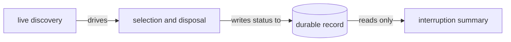

# fix: Preserve the record of an interrupted disposal batch

## Overview

When a disposal batch is interrupted, the user keeps an accurate record of what happened to every token. A durable record owned above the connection and network guards survives their unmount and reports per-token status honestly.

The record is exactly that — a record. It never drives execution.

## Problem Frame

Disposal processes tokens sequentially, one wallet signature each. When the wallet disconnects or the chain changes mid-batch, `app/flush/page.tsx` and `components/web3/network-guard.tsx` each swap `DisposalFlow` out for a prompt. Stopping further submissions is correct. Erasing the account of the ones already made is not.

A user who signed two of five burns lands on "Connect your wallet" with no record of the two that completed or the three that did not. The tokens were destroyed irreversibly and the interface shows nothing.

A prior attempt fixed this inside `DisposalFlow` and was reverted. The component is unmounted in the same render pass the condition trips, so nothing it holds can survive (see `docs/plans/2026-09-20-001-feat-e2e-burn-path-coverage-plan.md`, Unit 5, withdrawn).

## Requirements Trace

Carried from the origin document:

- R1. The record is owned above the connection and network guards, so it survives the unmount of `DisposalFlow`.
- R2. On confirmation, the record captures the token list, the initiating account, and the chain. Later discovery results do not change what the record says the batch was.
- R3. Each token carries one of five recorded statuses: confirmed, submitted, failed, unresolved, not started. A sixth value, `prompting`, is written while a wallet request is outstanding. It is never a resting state and is never shown to the user as an outcome — it exists so an interruption during the prompt resolves to unresolved rather than being indistinguishable from not started. Any `prompting` value found in storage on read is an interrupted prompt and resolves to unresolved.
- R4. A token whose wallet request was issued but never resolved is recorded as unresolved, never as not started.
- R5. Confirmed requires an on-chain receipt reporting success. Submission alone is reported as submitted.
- R6. Language reflects the distinction — a submitted token is not described as flushed.
- R7. On disconnect or chain change, no further requests are issued.
- R8. The interruption summary stays visible alongside reconnect controls, rather than being replaced by a generic prompt.
- R9. The batch never resumes automatically, and this plan provides no manual resume either (see Scope Boundaries).

Added after research and review:

- R10. A wallet request that does not settle within a bounded interval, or that the user explicitly abandons, transitions the token to unresolved and stops the batch. A late result arriving after that transition must not revive the token or enqueue a transaction.
- R11. Stored records are bounded in age and content. Nothing is persisted that the summary does not need.
- R12. A token's failure reason is persisted as a sanitized reason code plus user-facing text, so a reload does not reduce it to a bare failure and raw provider output never reaches storage.

## Scope Boundaries

- **The record never drives execution.** Stored data is attacker-writable by anything with origin access. It informs the summary; it is never the input to a burn. Token selection and disposal continue to derive from live discovery exactly as they do today.
- Resuming an interrupted batch, manually or automatically. The summary reports what happened and offers a clean start.
- Recovering or reversing a submitted burn. Not possible.
- Changing the sequential one-signature-per-token model.
- Replacing the transaction queue. This work consumes it.
- Multi-tab coordination. See below.

### Deferred to Separate Tasks

- **Tab ownership.** Two tabs sharing storage can produce a confusing record. This was planned and cut: any same-origin script can ignore a tab-owner flag, so it is a coordination convenience rather than a security boundary, and it is not required to fix record loss. Revisit if multi-tab use proves common.
- **Manual resume with per-token retry.** Reviewers split sharply on whether "report and start over" strands the user. Revisit once real interruption behavior is observable.
- **Integrity-protected records.** If a future change ever makes stored state drive a destructive action, that change must carry an integrity mechanism. This plan avoids the need by keeping the record read-only.

## Context & Research

### Relevant Code and Patterns

- `lib/web3/transaction-queue.ts` — module singleton persisting to `localStorage` under `tokentoilet:transaction-queue`. Serializes bigints, reloads on startup, monitors pending entries with `waitForTransactionReceipt`, and maps `receipt.status === 'success'` to confirmed and `reverted` to failed. The pattern to follow and the seam to consume.
- `hooks/use-transaction-queue.ts` — hook facade exposing transactions, status buckets, and `onTransactionConfirmed` / `onTransactionFailed`.
- `hooks/use-wallet-persistence.ts` — precedent for age-bounded persisted state.
- `hooks/use-token-disposal.ts` — per-token write hook. Adds the hash to the queue on write success. `isSuccess` means a hash was returned, not that the burn confirmed. Uses wagmi's mutation API, which exposes no abort handle.
- There is no custom `createContext` pattern in this codebase. Durable shared state is module singleton plus `localStorage` plus a hook facade.

### Institutional Learnings

- `docs/solutions/workflow-issues/library-changes-need-consumer-verification-2026-06-21.md` — changing a shared contract requires verifying downstream consumers. This work changes what the page and `DisposalFlow` exchange.

## Prior-Art Survey

```json
{
  "schema_version": 2,
  "verdict": "extend",
  "scope": "repo root, focused on app/, components/web3/, hooks/, lib/web3/, and docs/solutions/workflow-issues/",
  "freshness": {
    "vcs_reference": "c9f1db7888216ac91f572803611337e2b4b5efe1"
  },
  "budget": {
    "max_search_passes": 3,
    "max_candidate_inspections": 8,
    "exhausted": false
  },
  "candidates": [
    {
      "path_or_symbol": "lib/web3/transaction-queue.ts",
      "description": "Singleton transaction queue that persists queued transactions to localStorage, reloads them on startup, polls waitForTransactionReceipt, and emits pending/confirmed/failed updates.",
      "disposition": "extend"
    },
    {
      "path_or_symbol": "hooks/use-transaction-queue.ts",
      "description": "Hook facade over the queue that materializes transactions, status buckets, counts, and onTransactionConfirmed/onTransactionFailed callbacks for consumers.",
      "disposition": "extend"
    },
    {
      "path_or_symbol": "hooks/use-token-disposal.ts",
      "description": "Per-token write hook exposing dispose, isPending, isSuccess, error, and txHash, adding the submitted hash to the queue on write success.",
      "disposition": "insufficient",
      "insufficiency_reason": "Knows only simulation and write submission; cannot represent a wallet request that never settles, and holds no batch-level record."
    },
    {
      "path_or_symbol": "components/web3/disposal-flow.tsx",
      "description": "Route-local select/confirm/dispose/results flow owning selection, current index, and terminal results.",
      "disposition": "insufficient",
      "insufficiency_reason": "Unmounted by the guards in the same render pass the interruption occurs, so no state it owns can survive."
    },
    {
      "path_or_symbol": "hooks/use-wallet-persistence.ts",
      "description": "localStorage-backed wallet-session rehydration for connection metadata, preferred chain, and auto-reconnect settings.",
      "disposition": "insufficient",
      "insufficiency_reason": "Persists connection metadata only; carries no per-operation progress record. Useful as an age-bounding precedent, not as a host."
    }
  ]
}
```

## Key Technical Decisions

- **The record is read-only with respect to execution.** Stored state is attacker-writable, so making it the source of the token list would let a tampered snapshot drive an irreversible burn — a surface that does not exist today. The record informs the summary; live discovery continues to drive selection and disposal. This also removes the need for an integrity mechanism.
- **The record lives in a module singleton with a `localStorage` backing and a hook facade**, matching the only durable-state pattern in the codebase and surviving both guards and a reload.
- **Confirmation comes from the transaction queue.** It already resolves receipts, survives reload, and distinguishes success from reverted. The record subscribes and maps queue status onto its token entries.
- **A token is written as `prompting` before the wallet request is issued**, which is what makes unresolved recoverable after an unmount. A status written only on settlement is lost precisely when it matters.
- **A late result is gated, not merely ignored.** wagmi's mutation API exposes no abort handle, so a timeout cannot cancel a prompt — the user may sign minutes later and `onSuccess` will still fire. Each attempt carries a token identity that is invalidated when the attempt is abandoned; a settlement arriving against an invalidated attempt updates nothing and enqueues nothing. Without this, the timeout makes the record less accurate rather than more.
- **Confirmed derives from a success receipt, never receipt existence.** A reverted transaction has a receipt and is a failure.
- **Failure reasons are sanitized before storage.** Raw provider errors can carry endpoint URLs and request context. A reason code plus display text is stored; the raw error is not.
- **No resume** (see Scope Boundaries).

## Open Questions

### Resolved During Planning

- Where the record lives: module singleton plus `localStorage` plus hook facade.
- Whether the results view polls receipts independently: no, it subscribes to the queue.
- Whether resume is in scope: no.
- Whether the record drives execution: no — this was the plan's most consequential correction.

### Deferred to Implementation

- The exact timeout interval before a prompting token becomes unresolved. It must exceed realistic hardware-wallet signing time; choose against observed behavior rather than guessing.
- Whether the retention bound is best enforced on read, on write, or both.

## High-Level Technical Design

> *This illustrates the intended approach and is directional guidance for review, not implementation specification. The implementing agent should treat it as context, not code to reproduce.*

Per-token status. The record owns everything left of the hash; the transaction queue owns everything right of it.

```mermaid
stateDiagram-v2
    [*] --> not_started: batch confirmed, record created
    not_started --> prompting: written BEFORE the wallet request
    prompting --> submitted: hash returned, attempt still valid
    prompting --> failed: rejected or simulation reverted
    prompting --> unresolved: timeout, user abandon, or unmount while prompting
    submitted --> confirmed: queue receipt status success
    submitted --> failed: queue receipt status reverted
    unresolved --> [*]: terminal; a late result is gated out
    confirmed --> [*]
    failed --> [*]
```



Two separate paths, which is the point — the untrusted record never reaches execution:



## Implementation Units

- [ ] **Unit 1: Record store and schema**

**Goal:** A durable per-token record exists, independent of any component.

**Requirements:** R1, R2, R3, R11, R12

**Dependencies:** None

**Files:**
- Create: `lib/web3/batch-record.ts`
- Test: `lib/web3/batch-record.test.ts`

**Approach:**
- Module singleton with `localStorage` backing, mirroring `lib/web3/transaction-queue.ts` including its bigint serialization, since balances are bigints.
- The record holds an id, the initiating account, the chain, a creation timestamp, and per-token entries.
- Each entry holds the contract address, symbol, decimals, the balance at confirmation, a status, an optional hash, and an optional sanitized failure reason. Store nothing the summary does not display (R11).
- Status is a discriminated union. A hash is only present on submitted and confirmed; a failure reason only on failed.
- Validate on read. Malformed data is discarded and reported as absent, never thrown into a render.
- Reading an entry in `prompting` resolves it to unresolved — a prompt that was interrupted before settling.

**Patterns to follow:**
- `lib/web3/transaction-queue.ts` for singleton shape, persistence, and bigint handling.

**Test scenarios:**
- Happy path: a record round-trips through storage with bigint balances intact.
- Happy path: a status transition persists and survives a simulated reload.
- Edge case: an entry stored as `prompting` reads back as unresolved.
- Edge case: malformed stored JSON is discarded and reported as absent, not thrown.
- Edge case: an entry carrying a hash in a status that forbids one is rejected by the type model at compile time.
- Error path: a `localStorage` quota failure surfaces without corrupting the in-memory record.

**Verification:** A record round-trips with bigints intact, and no stored value can crash a consumer.

---

- [ ] **Unit 2: Record hook and queue subscription**

**Goal:** Components read the record, and confirmation flows in from the transaction queue.

**Requirements:** R3, R5

**Dependencies:** Unit 1

**Files:**
- Create: `hooks/use-batch-record.ts`
- Test: `hooks/use-batch-record.test.ts`

**Approach:**
- Hook facade over the singleton, mirroring `hooks/use-transaction-queue.ts`.
- Subscribe to the queue's confirmed and failed callbacks; map a queue transaction to its entry by hash.
- Confirmed requires the queue's success status. A reverted receipt maps to failed with its reason.
- Derive counts from the entries themselves. Never compute a count by subtracting completed from total — that cannot distinguish in-flight from never-started, which is the specific defect this work removes.

**Patterns to follow:**
- `hooks/use-transaction-queue.ts` for facade shape and event subscription.

**Test scenarios:**
- Happy path: a queue confirmation for a known hash moves that entry to confirmed.
- Happy path: counts by status derive from entries and sum to the record size.
- Edge case: a queue event for an unknown hash is ignored.
- Error path: a reverted receipt maps to failed, never confirmed.
- Integration: a token submitted before a reload is confirmed by the queue afterward and the record reflects it.

**Verification:** Status counts always sum to the record size, and no count is derived by subtraction.

---

- [ ] **Unit 3: Status recording, abandonment, and the late-result gate**

**Goal:** Every token's real status is recorded, including a wallet prompt that never settles — and a late signature cannot corrupt that record.

**Requirements:** R4, R7, R10, R12

**Dependencies:** Unit 2

**Files:**
- Modify: `components/web3/disposal-flow.tsx`
- Modify: `hooks/use-token-disposal.ts`
- Test: `components/web3/disposal-flow.test.tsx`
- Test: `hooks/use-token-disposal.test.ts`

**Approach:**
- Write `prompting` immediately before issuing the wallet request, so an unmount or reload during the prompt is recoverable as unresolved.
- On settle, transition to submitted or failed, persisting a sanitized reason.
- A bounded timeout while prompting, or a user-triggered stop, transitions the entry to unresolved and stops the batch. The manual control matters: a timeout alone either fires too early for a hardware wallet or leaves the user waiting.
- **The late-result gate is the load-bearing part.** wagmi's mutation exposes no abort handle, so the prompt stays live after the timeout. Give each attempt an identity, invalidate it on abandonment, and check validity in the settlement handler before updating the record or enqueueing. A late success must not revive an unresolved token and must not reach the transaction queue.
- Stopping means issuing no further requests. It does not cancel an outstanding one, which is not possible.

**Execution note:** Write the late-result test first — a signature arriving after abandonment. It is the case most likely to be satisfied only in appearance, and getting it wrong makes the record less accurate than doing nothing.

**Test scenarios:**
- Happy path: a signed token moves prompting to submitted with its hash recorded.
- Edge case: unmounting while prompting leaves the entry unresolved, never not-started.
- Edge case: the timeout transitions a prompting entry to unresolved and no further token is attempted.
- Edge case: the manual stop control produces the same outcome as the timeout.
- Error path: a signature arriving after abandonment updates no entry and enqueues no transaction.
- Error path: a rejected signature records failed with a reason distinguishable from a reverted simulation.
- Error path: a raw provider error is sanitized before storage — no endpoint URL or request context persists.
- Integration: after a stop, no subsequent entry leaves not-started.

**Verification:** A prompt interrupted by unmount, timeout, or user action is recorded as unresolved, and a late signature cannot change that.

---

- [ ] **Unit 4: Interruption summary above the guards**

**Goal:** An interrupted batch is reported instead of being replaced by a generic prompt.

**Requirements:** R1, R8, R9

**Dependencies:** Unit 2

**Files:**
- Modify: `app/flush/page.tsx`
- Create: `components/web3/batch-interruption-summary.tsx`
- Test: `components/web3/batch-interruption-summary.test.tsx`

**Approach:**
- The page checks for a record before the connection branch. When one exists and the wallet is disconnected or the chain unsupported, render the summary rather than the connect or switch-network prompt.
- Reconnect or switch-network controls appear inline, alongside a way to discard.
- No resume control. Discarding returns to selection, where remaining tokens are chosen normally.

**Design direction — this is the most sensitive screen in the app and must not be left to invention:**
- Each of the five statuses needs distinct, plain language. Reviewers rated the prior draft 3/10 here. Specify the label and one-line explanation for each before building: what a confirmed burn says, what a submitted-but-unconfirmed burn says, what a failed burn says, what an unresolved burn says, and what an untouched token says.
- **Unresolved is the hardest and most important.** It means the wallet was asked and never answered, so the token may or may not have been burned. Say that plainly, and tell the user what they can do — checking the burn address on a block explorer is a concrete action; "unresolved" alone is not.
- Cover the in-between states: loading the record, a mix of terminal and still-resolving entries, and what a submitted entry shows while its receipt is pending.
- **Discard destroys the only record of an irreversible action.** Treat it with weight proportional to that. The burn confirmation already uses typed confirmation for irreversible actions; discard should not feel like a back button. Confirm before discarding when any entry is unresolved or submitted.
- Do not imply anything can be undone.
- Accessibility: the summary is a semantic list or table; status changes as receipts resolve are announced without flooding; controls keep accessible names and focus survives reconnect and discard.
- Design tokens only.

**Patterns to follow:**
- Existing guard prompts in `app/flush/page.tsx` and `components/web3/network-guard.tsx` for placement.
- The typed-confirmation pattern in the burn confirm step for weighting the discard action.

**Test scenarios:**
- Happy path: with a record and a disconnected wallet, the summary renders and the connect prompt does not.
- Happy path: each of the five statuses renders distinctly.
- Edge case: an unsupported chain shows the summary with a switch-network control.
- Edge case: a submitted entry shows a pending-receipt state, not a terminal one.
- Edge case: discarding with an unresolved entry requires explicit confirmation.
- Edge case: discarding clears the record and returns to selection.
- Accessibility: the summary is announced, status updates do not flood assistive technology, and every control has an accessible name.

**Verification:** A disconnect mid-batch shows the record rather than a connect prompt, and no path implies resumption or undo.

---

- [ ] **Unit 5: Honest completion reporting**

**Goal:** The results view stops overstating what happened.

**Requirements:** R5, R6

**Dependencies:** Unit 2

**Files:**
- Modify: `components/web3/disposal-flow.tsx`
- Test: `components/web3/disposal-flow.test.tsx`

**Approach:**
- Replace the derived unattempted count with counts from the record's entries.
- A token is described as flushed only when it holds a success receipt. A submitted token is described as submitted and still pending.
- Use the same language as the interruption summary. A user seeing both should not have to reconcile two vocabularies.

**Test scenarios:**
- Happy path: a confirmed token is described as flushed.
- Edge case: a submitted but unconfirmed token is not described as flushed.
- Edge case: a reverted token is reported as failed.
- Edge case: counts match the record exactly across a mix of all five statuses.

**Verification:** No interface text claims a burn completed when only a submission occurred.

---

- [ ] **Unit 6: Retention**

**Goal:** Stored records do not accumulate or outlive their usefulness.

**Requirements:** R11

**Dependencies:** Units 1, 4

**Files:**
- Modify: `lib/web3/batch-record.ts`
- Test: `lib/web3/batch-record.test.ts`

**Approach:**
- A record whose entries all reached a terminal status is cleared when the user leaves the results view.
- A stored record older than its maximum age is discarded on read. Follow the age-bounding precedent in `hooks/use-wallet-persistence.ts`.
- This is data minimization, not correctness. The record holds a wallet address and a holdings snapshot; it should not persist indefinitely. Because the record no longer drives execution, staleness is a privacy question rather than a safety one.
- On reconnect with an account other than the one recorded, do not display the prior account's holdings. Retain the record but require explicit action to reveal it, so a shared browser does not expose one user's balances to the next.

**Test scenarios:**
- Happy path: a fully terminal record is cleared on leaving results.
- Edge case: a record past its maximum age is discarded on read and reported as absent.
- Edge case: a record exactly at the age boundary behaves deterministically.
- Edge case: reconnecting with a different account does not display the prior holdings without explicit action.

**Verification:** No record outlives its bound, and no account's holdings are shown to a different account by default.

## System-Wide Impact

- **Interaction graph:** `app/flush/page.tsx` gains a branch ahead of both guards. `hooks/use-token-disposal.ts` gains a pre-request status write and a settlement validity check. `components/web3/disposal-flow.tsx` writes status and reads counts, but continues to derive its token list from live discovery.
- **Error propagation:** Failure reasons persist in sanitized form rather than living in volatile state.
- **State lifecycle risks:** `localStorage` is shared across tabs. Two tabs can produce a confusing record; they cannot produce a burn, because the record does not drive execution. Tab coordination is deferred (see Scope Boundaries).
- **API surface parity:** None. No contract, chain, or route surface changes.
- **Integration coverage:** The queue-to-record confirmation path and the late-result gate both cross layers and cannot be proven by unit tests alone. Both suit the browser suite added in `c9f1db7`.
- **Unchanged invariants:** Transaction construction is untouched — recipient, amount, contract, and chain remain as verified by the existing burn-construction assertions. Selection and disposal continue to derive from live discovery. The transaction queue's own behavior is unchanged.

## Risks & Dependencies

| Risk | Mitigation |
|------|------------|
| The late-result gate is implemented as a naive ignore and a late signature still enqueues | Attempt identity checked in the settlement handler; covered by a dedicated Unit 3 error-path test written first |
| The prompting timeout fires during a slow hardware-wallet signature | Pair the timeout with a user-triggered stop; choose the interval against observed behavior |
| Writing status before the wallet request delays the burn path | The write is local and synchronous and must not be awaited in a way that delays the request |
| A write succeeds but the request never issues, leaving a phantom prompting entry | Such an entry resolves to unresolved on read, which is the honest outcome |
| The record and the queue disagree | The queue is authoritative for anything with a hash; the record is authoritative only before one exists |
| Persisted holdings expose wallet data on a shared browser | Bounded retention and account-mismatch gating (Unit 6); store only what the summary displays |

## Documentation / Operational Notes

- `docs/solutions/` warrants an entry after this lands: when a flow can be unmounted by a guard during an irreversible multi-step operation, the record of progress must live above the guard, must distinguish submitted from confirmed, and must not become an execution input. The last clause was learned during review of this plan, after an earlier draft would have let attacker-writable storage drive a burn.
- No migration. An absent or unparseable record is simply no record.

## Sources & References

- **Origin document:** `docs/brainstorms/2026-09-20-batch-interruption-requirements.md`
- Withdrawn prior attempt: `docs/plans/2026-09-20-001-feat-e2e-burn-path-coverage-plan.md`, Unit 5
- Commits: `b0b53cc` (attempt), `5ada87a` (revert)
- Consumer-verification guardrail: `docs/solutions/workflow-issues/library-changes-need-consumer-verification-2026-06-21.md`
- Reuse seam: `lib/web3/transaction-queue.ts`, `hooks/use-transaction-queue.ts`
- Age-bounding precedent: `hooks/use-wallet-persistence.ts`
